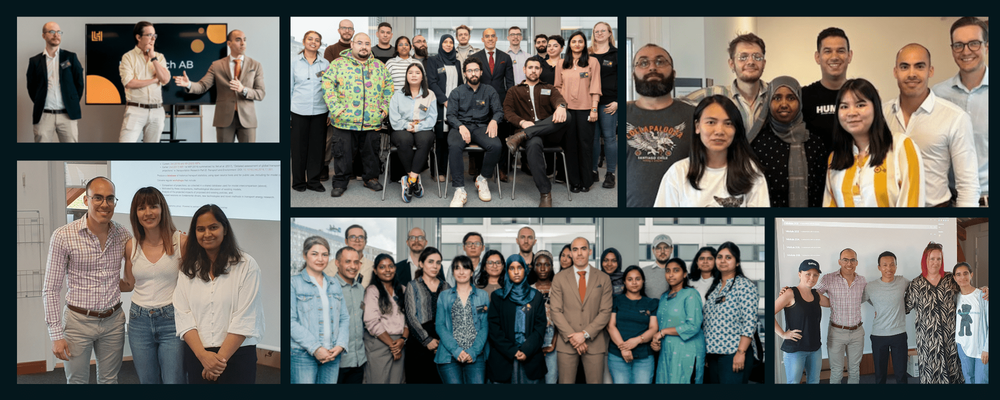

# Welcome to the community!

The *Linero Tech Community* aims to be a centralized place where students can ask questions, find answers, and share experiences. Think of it as an all-in-one knowledge base, support forum, resource hub, and inspiration station.

The goal is to provide our students with the necessary support during their educational journey. Regardless of how big or small your challenge or question is, all resources and information will be available in this community in a true open-source fashion.

## Popular Discussions Categories
| **Category** | **Purpose** 	|
|---	|---	|
| 👨‍⚕️ [CV, Portfolio, Jobs](https://github.com/linero-tech/community/discussions/categories/cv-portfolio-jobs) | Career-related discussions, questions, and tips |
| 💡 [Suggestions & Feedback](https://github.com/linero-tech/community/discussions/categories/suggestions-feedback) | Share ideas or feedback on how to improve the education |
| ❓[_General](https://github.com/linero-tech/community/discussions/categories/_general) | General help needed |
| 🤖 [Android](https://github.com/linero-tech/community/discussions/categories/android) | Questions associated to Android |
| 📊 [Data Visualization](https://github.com/linero-tech/community/discussions/categories/data-visualization) | Questions associated to Data Visualization |
| 🏝️ [Kotlin](https://github.com/linero-tech/community/discussions/categories/kotlin) | Questions associated to Kotlin |
| 🐍 [Python](https://github.com/linero-tech/community/discussions/categories/python) | Questions associated to Python |

> [!IMPORTANT] 
> By participating in the discussions of the *Linero Tech Community*, you agree to follow the [CODE OF CONDUCT](https://github.com/linero-tech/community/blob/main/CODE_OF_CONDUCT.md) of the community.